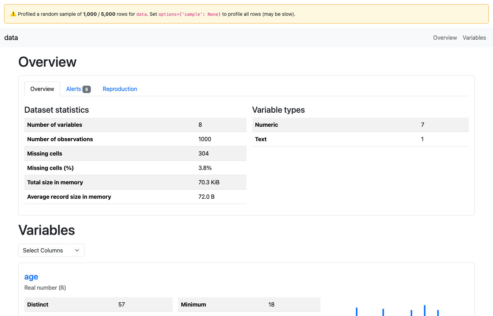
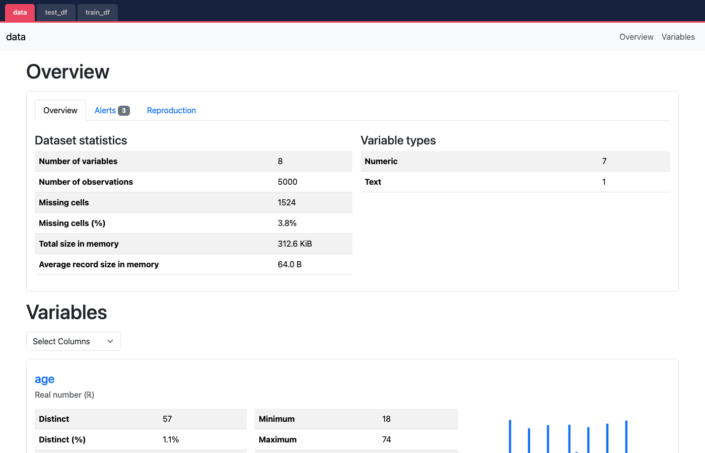
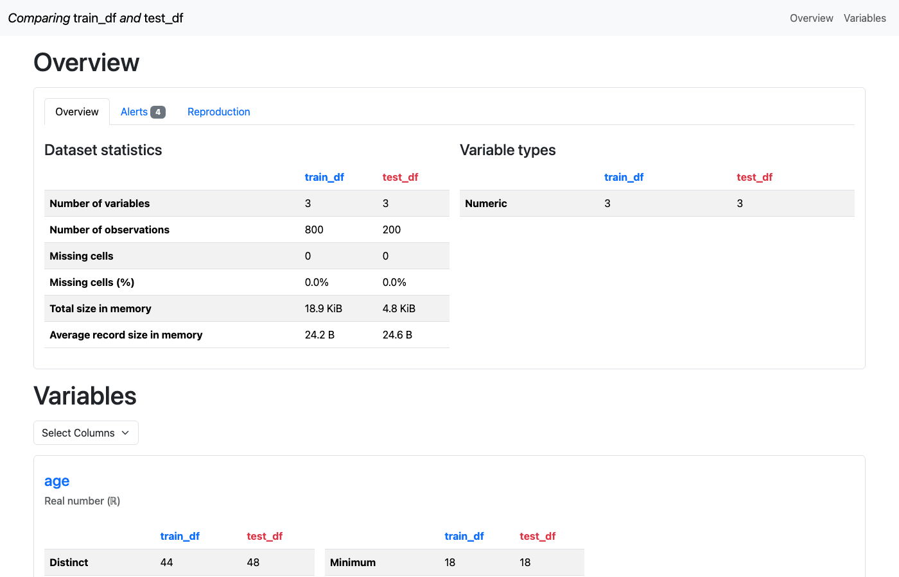
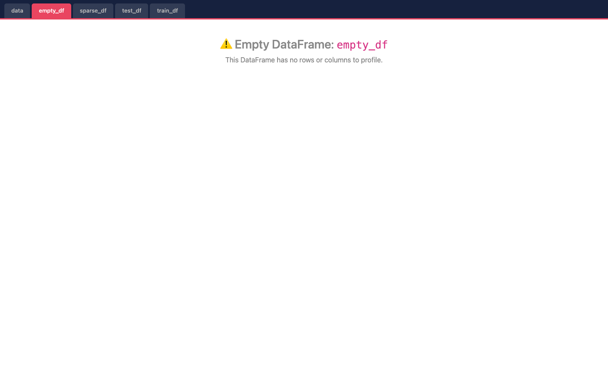

# metaflow-dataprofiler

Automatic DataFrame profiling card for [Metaflow](https://metaflow.org), powered by
[ydata-profiling](https://github.com/ydataai/ydata-profiling).

Add `@card(type='dataprofile')` to any step and get a rich EDA report for every
`pandas.DataFrame` artifact — Overview, Variables, Alerts, Correlations, Missing Values,
and Sample — with **zero changes inside the step**.

---

## Screenshots

### Single DataFrame — with sampling warning

> `start` step: 5,000-row loan dataset, sampled to 1,000 rows for speed.
> The yellow banner shows exactly how many rows were sampled.



### Multiple DataFrames — tabbed layout

> `split` step: three DataFrames (`data` from the prior step, plus `train_df` and `test_df`).
> Each gets its own tab in the dark nav bar.



### Comparison mode — side-by-side distributions

> `compare` step: `@card(type='dataprofile', options={'compare': ['train_df', 'test_df']})`.
> ydata-profiling's native comparison shows per-variable statistics side-by-side for both datasets.



### Edge case — empty DataFrame handled gracefully

> `edge` step: five DataFrames including one empty one (`empty_df`).
> The `empty_df` tab shows a placeholder instead of crashing.



---

## Installation

```bash
pip install metaflow-dataprofiler
```

No additional setup. After installation, `@card(type='dataprofile')` is available in any
Metaflow flow.

---

## Usage

### Zero-code path (primary use case)

```python
from metaflow import FlowSpec, step, card
import pandas as pd

class MyFlow(FlowSpec):

    @card(type='dataprofile')
    @step
    def process(self):
        self.train_df = pd.read_parquet("train.parquet")
        self.test_df  = pd.read_parquet("test.parquet")
        self.next(self.end)

    @step
    def end(self):
        pass
```

The card auto-discovers every `pd.DataFrame` on `self`, profiles each one, and renders a
tabbed HTML report. Nothing to change inside the step.

---

### Scoping — `include` / `exclude`

```python
# Profile only specific artifacts
@card(type='dataprofile', options={'include': ['train_df', 'test_df']})

# Skip one artifact
@card(type='dataprofile', options={'exclude': ['lookup_df']})
```

---

### Comparison mode

```python
@card(type='dataprofile', options={'compare': ['train_df', 'test_df']})
@step
def split(self):
    self.train_df, self.test_df = train_test_split(data)
```

Renders ydata-profiling's native side-by-side comparison. Ideal for catching
distributional skew immediately after a train/test split.

---

### Inline / explicit path

Profile DataFrames that are not stored as artifacts, or produce before/after views:

```python
from metaflow import FlowSpec, step, card, current
from metaflow_dataprofiler import DataProfileComponent

class MyFlow(FlowSpec):

    @card
    @step
    def clean(self):
        raw = load_data()
        current.card.append(DataProfileComponent(raw, title="Before cleaning"))
        self.df = clean(raw)
        current.card.append(DataProfileComponent(self.df, title="After cleaning"))
        self.next(self.end)
```

---

## Options

| Option | Type | Default | Description |
|---|---|---|---|
| `include` | `list[str]` | all DataFrames | Artifact names to profile |
| `exclude` | `list[str]` | `[]` | Artifact names to skip |
| `compare` | `list[str, str]` | `None` | Two artifact names to diff side-by-side |
| `sample` | `int \| None` | `50_000` | Row cap before profiling. `None` = no cap (may be slow) |
| `minimal` | `bool` | `False` | Skip correlations and interactions (faster) |
| `title` | `str` | artifact name | Tab label override (single-DataFrame case only) |

---

## What the card shows

Each profiled DataFrame gets a full ydata-profiling report with:

1. **Overview** — row count, column count, missing cells %, duplicate rows %, memory usage, variable type breakdown
2. **Alerts** — data quality warnings (high cardinality, high correlation, skewness, missing values, zeros, constant columns…)
3. **Variables** — per-column histogram, statistics (mean / median / std / min / max / IQR), missing count, unique count
4. **Correlations** — Pearson, Spearman, Cramér's V heatmap (skipped in `minimal` mode)
5. **Missing values** — matrix and bar chart of nulls by column
6. **Sample** — first and last rows of the raw DataFrame

In `compare` mode, ydata-profiling renders distribution overlays for every variable
between the two DataFrames — great for catching train/test leakage.

---

## Behavior details

**Large DataFrames:** If the DataFrame has more than `sample` rows (default 50,000), a
random sample is taken and a warning banner is shown at the top of the card. The sample
is reproducible (fixed random seed).

**Empty DataFrames:** Renders a placeholder tab with a warning instead of crashing.

**Profiling errors:** If ydata-profiling raises on a specific DataFrame (e.g., all-null
columns), the error is shown in that tab and remaining DataFrames are still profiled.

**Multiple DataFrames without `compare`:** Each is profiled independently and rendered as
a named tab. Tab label is the artifact name, overridable with `title`.

---

## Running the demo flow

```bash
pip install -e ".[dev]"
python tests/test_flow.py run

# View individual cards:
python tests/test_flow.py card get 1/start  --type dataprofile
python tests/test_flow.py card get 1/split  --type dataprofile
python tests/test_flow.py card get 1/compare --type dataprofile
python tests/test_flow.py card get 1/edge   --type dataprofile
```

---

## Running tests

```bash
pip install -e ".[dev]"
pytest tests/test_unit.py -v
```

All 32 unit tests run without ydata-profiling (mocked), so they are fast and CI-safe.

---

## Requirements

- Python ≥ 3.8
- metaflow ≥ 2.7
- ydata-profiling ≥ 4.0
- pandas ≥ 1.3

---

## Future work (v2+)

- Polars DataFrame support
- `@card(type='datadrift')` sibling card comparing against a reference run's artifact
- Time-series profiling mode (ydata-profiling has native `tsmode` support)
- Per-step performance budgeting (abort profiling if it takes > N seconds)
